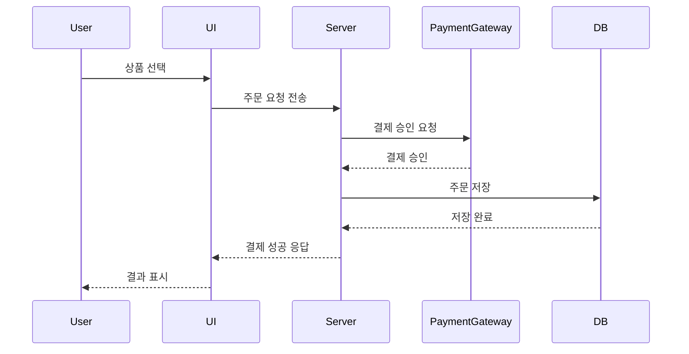

# reoprt
## 🛒 온라인 쇼핑 결제 시뮬레이션 프로그램

## 프로젝트 소개
이 프로젝트는 **온라인 쇼핑몰에서의 결제 과정을 시퀀스 다이어그램 기반으로 구현**한 프로그램입니다.  
사용자, UI, 서버, 결제 시스템, 데이터베이스 간의 상호작용을 구조화하여 구현했습니다.

## 개발 기간

* 2025.05.12일 ~ 2025.05.14일

## 개발 인원
    - 20231395 컴퓨터공학과 최세진

## 개발 환경
    - python 3.13.2

### 실행 방법
    
    $ cd online-shopping-sequence
    $ python main.py

## 📌 시나리오 개요

1. 사용자가 상품을 선택합니다.
2. UI가 서버에 주문 요청을 전달합니다.
3. 서버는 상품 정보를 확인하고 결제 요청을 보냅니다.
4. 결제가 승인되면 주문 정보를 DB에 저장합니다.
5. UI는 사용자에게 결제 결과를 출력합니다.

---

## 🧩 시퀀스 다이어그램 (Mermaid 사용)

### 시퀀스 다이어그램 이미지

---

## 주요 파일 설명 

| 파일명                | 설명                                                              
| -------------------- | ----------------------------------------------------------------- 
| `main.py`            | 테스트 시나리오 실행 (정상, 실패 케이스 포함)                                       
| `ui.py`              | UI 클래스 – 사용자 요청 수신 및 결과 출력                                        
| `shop_server.py`     | 서버 클래스 – 상품 확인, 결제 요청, DB 저장                                      
| `product_catalog.py` | 상품 가격 조회 및 존재 여부 판단                                               
| `payment_gateway.py` | 결제 승인 시뮬레이션 (성공/실패 조건 처리)                                        
| `database.py`        | 주문 내역 리스트에 저장                                                     
| `exceptions.py`      | 사용자 정의 예외: `ProductNotFoundException`, `PaymentDeclinedException`

---

## 모듈 평가 결과

| 모듈명            | 응집도  | 결합도   | 재사용성 | 유지보수성  | 확장성  | 평가 요약                   |
| ---------------- | --------| ------- | --------| ------------| -------| ---------------------------|
| `UI`             | 높음 ✅ | 낮음 ✅ | 중간 ⚠  | 높음 ✅    | 중간 ⚠ | CLI 환경에 적합한 UI        |
| `ShopServer`     | 중간 ⚠  | 중간 ⚠ | 낮음 ⚠  | 중간 ✅    | 중간 ⚠  | 향후 책임 분리 필요         |
| `ProductCatalog` | 높음 ✅ | 낮음 ✅ | 높음 ✅ | 높음 ✅    | 중간 ✅ | 단일 책임 원칙 충실         |
| `PaymentGateway` | 높음 ✅ | 낮음 ✅ | 중간 ✅ | 높음 ✅    | 낮음 ⚠  | 결제 방식 확장성 부족       |
| `Database`       | 높음 ✅ | 낮음 ✅ | 중간 ✅ | 높음 ✅    | 낮음 ⚠  | 단순 저장 기능에 충실       |
| `exceptions.py`  | 높음 ✅ | 없음 ✅ | 높음 ✅ | 높음 ✅    | 높음 ✅ | 전역 예외 정의로 활용성 높음 |

### 향후 개선 사항 

    -다양한 결제 방식 추가 (Strategy Pattern 도입)

    -배송 상태 추적 기능 추가

    -웹 UI (Flask, Django 등) 연동

    -단위 테스트 코드 및 테스트 자동화 도입

